# System Architecture Diagrams

## 1. System Architecture / Component Diagram

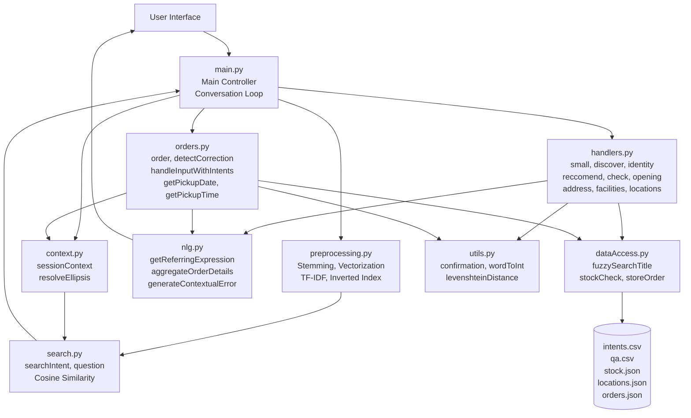

# 2. Intent Classification Flow

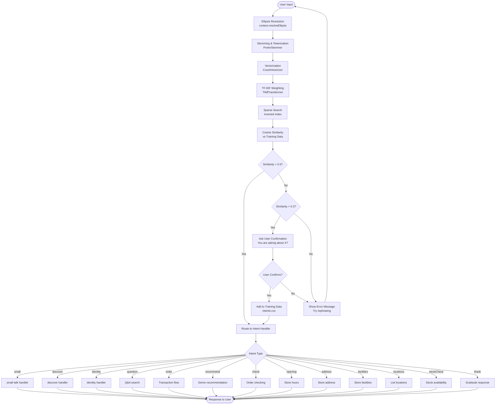

## 3. Order Transaction Flow with Correction Points

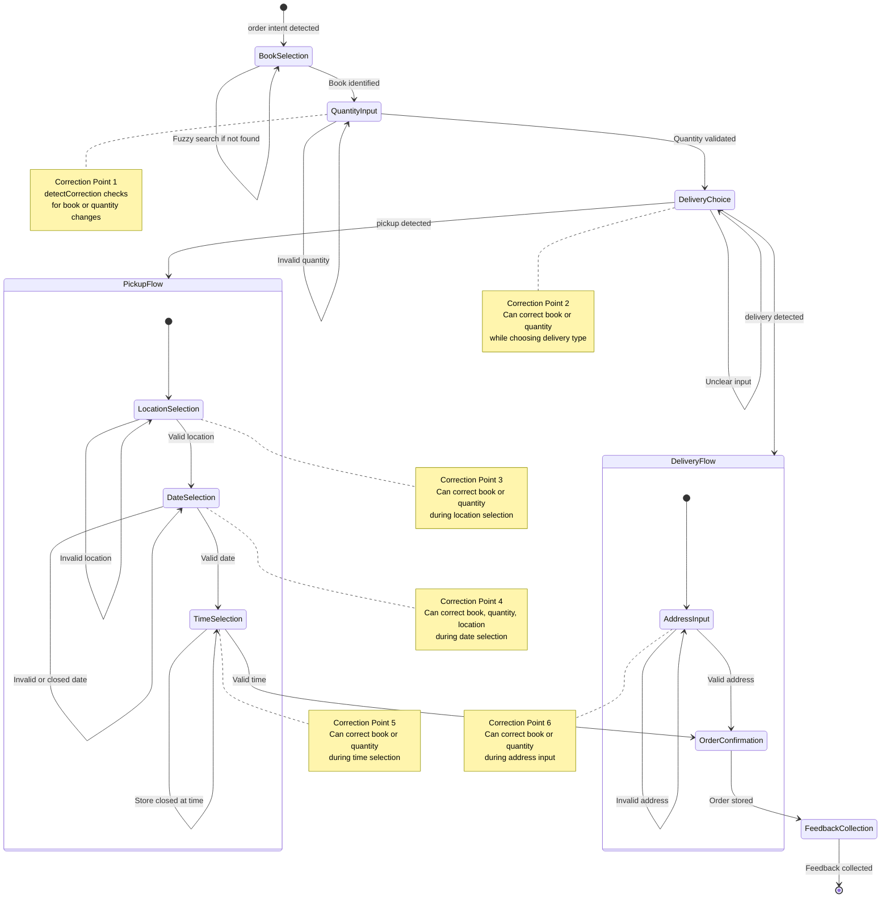

## 4. Context Management & Ellipsis Resolution

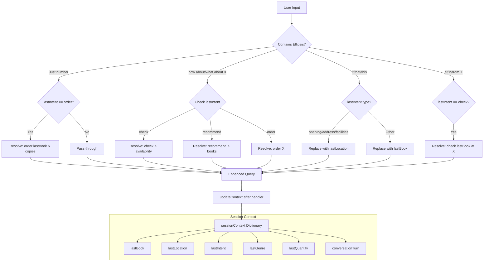

## 5. NLG Techniques Implementation

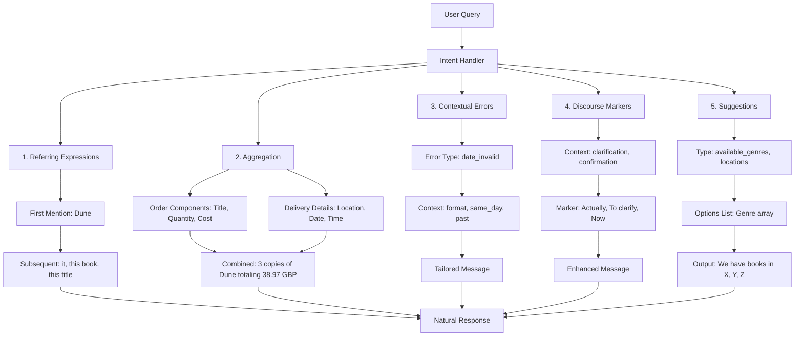

## 6. Inverted Index Structure

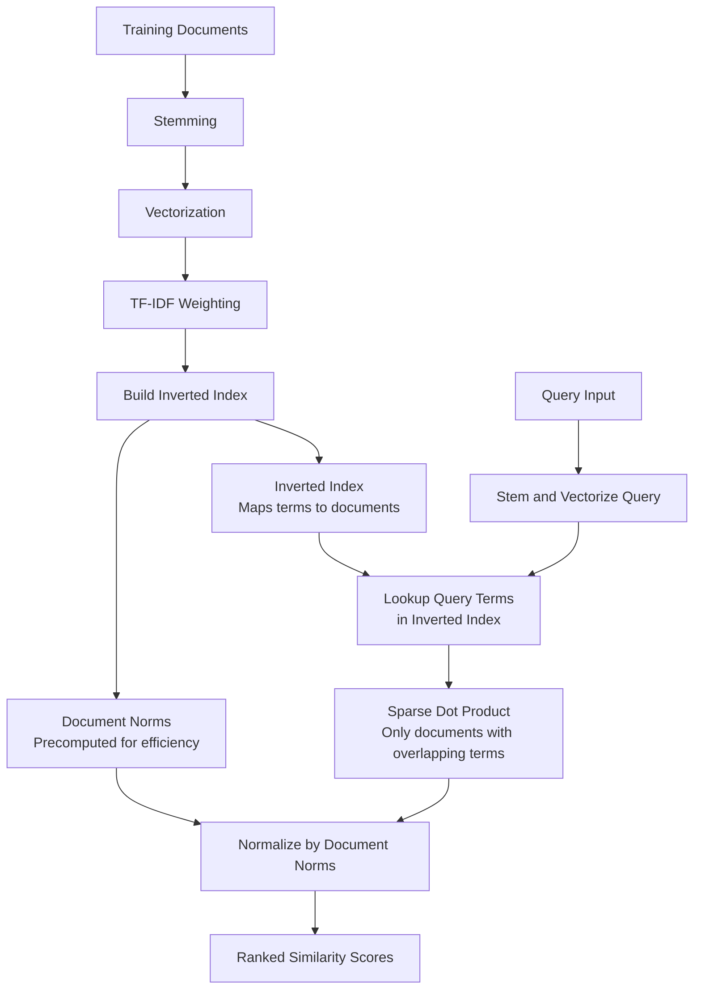

## 7. Data Flow Diagram

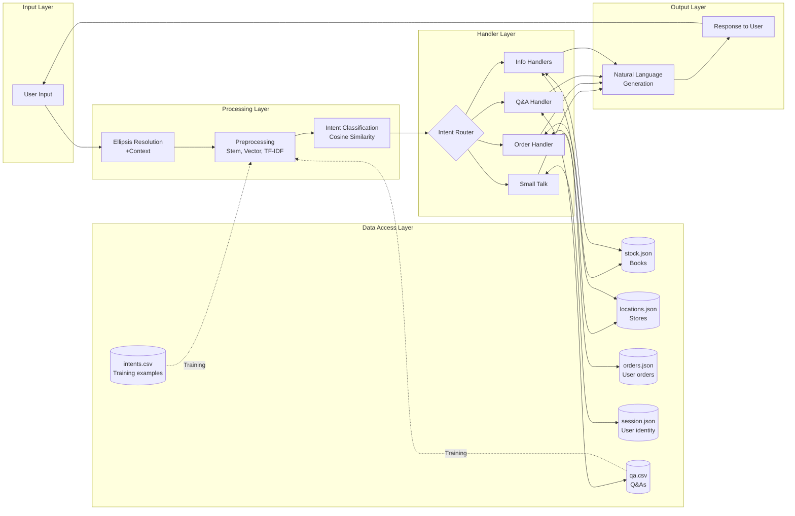

## 8. Correction Detection System

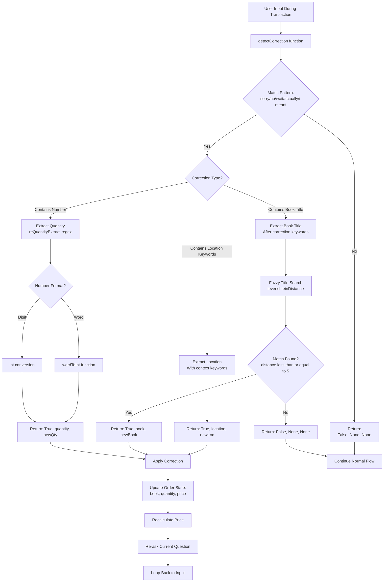

## 9. Small Talk Handler (ELIZA-style)

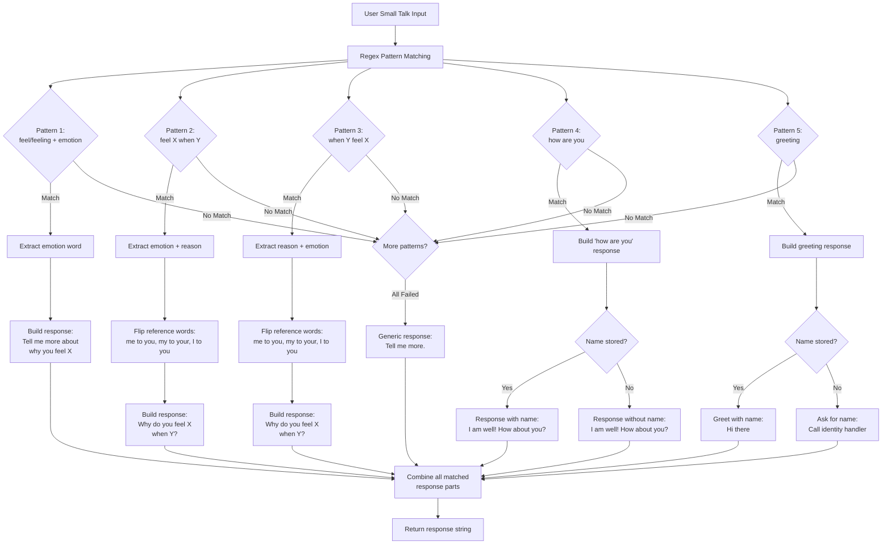

## 10. Transaction Input Interception

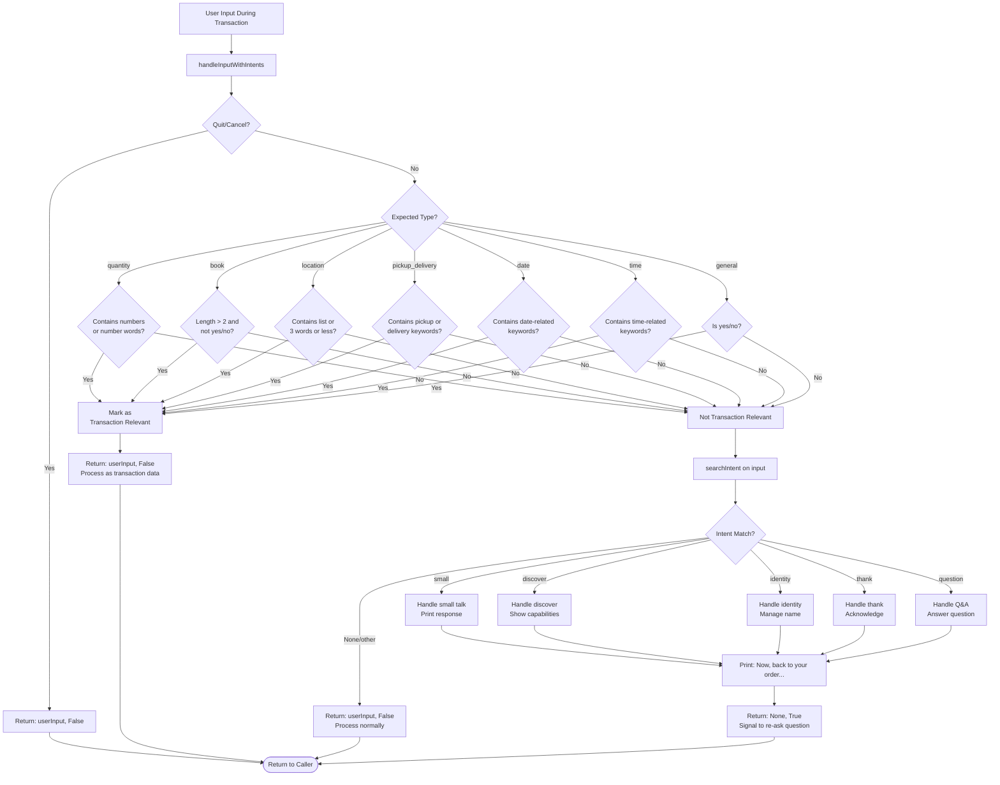

## 11. Recommendation System Flow

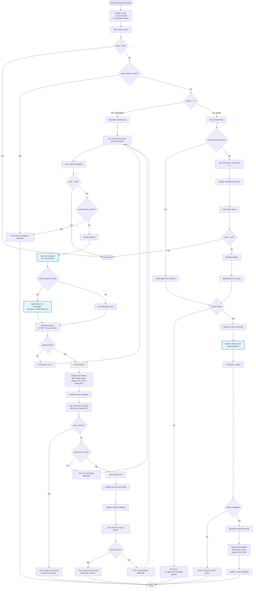

**Key Features:**
- **Two recommendation modes**: Genre-based (simple random selection) and Description-based (TF-IDF search)
- **Personalization**: Preferred genre from genre-based selections automatically enhances description-based searches
- **Fallback system**: Offers up to 2 recommendations per description search
- **Cancellation support**: Users can cancel at choice selection or description input
- **Session persistence**: Preferred genre saved to `session.json` for future searches
